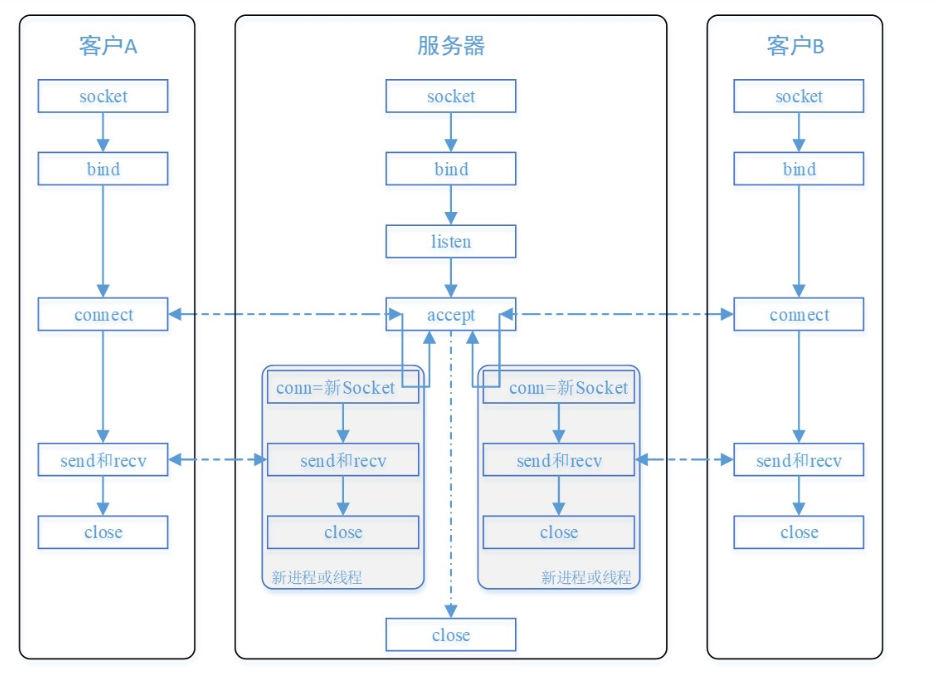
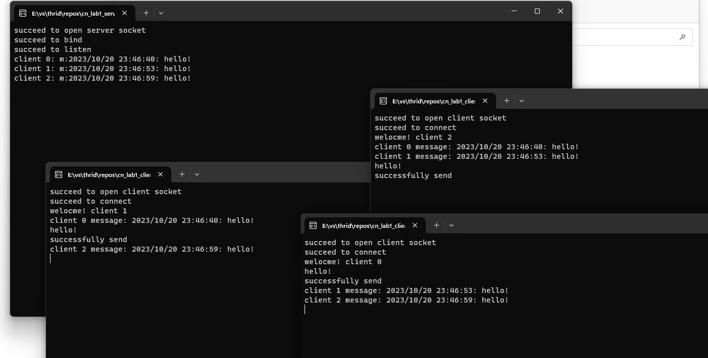

# lab1——利用Socket编写聊天程序

## 协议说明

1. **IP地址 (IP Address)**:

   使用`INADDR_ANY`监听所有可用的本地IP地址。

2. **端口 (Port)**:

   服务器使用端口号 6000 来监听客户端连接，而客户端也连接到相同的端口。

3. **协议 (Protocol)**:

   使用的协议是 TCP协议，确保数据可靠性和顺序传输。

4. **数据传输方式**:

   使用`SOCK_STREAM`，实现TCP连接双向传输，确保消息的可靠传递。每个客户端连接到服务器的套接字上都有一个独立的数据流。确保数据可以准确无误地到达另一台计算机，如果损坏或丢失，可以重新发送，但效率相对较慢。

5. **Socket缓冲区**:

   一旦将数据写入到缓冲区，函数就可以成功返回，不管它们有没有到达目标机器，也不管它们何时被发送到网络，这些都是TCP协议负责的事情。

   这里我们使用默认的Socket缓冲区设置，包括发送缓冲区和接收缓冲区，用于存储待发送和待接收的数据。

6. **阻塞模式**:

   对于TCP套接字（默认情况下），当使用`send() `发送数据时：

   1) 首先会检查缓冲区，如果缓冲区的可用空间长度小于要发送的数据，那么`send() `会被阻塞（暂停执行），直到缓冲区中的数据被发送到目标机器，腾出足够的空间，才唤醒send() 函数继续写入数据。

   2) 如果TCP协议正在向网络发送数据，那么输出缓冲区会被锁定，不允许写入，`send() `也会被阻塞，直到数据发送完毕缓冲区解锁，`send()` 才会被唤醒。

   3) 如果要写入的数据大于缓冲区的最大长度，那么将分批写入。

   4) 直到所有数据被写入缓冲区`send()` 才能返回。

   当使用`recv() `读取数据时：

   1) 首先会检查缓冲区，如果缓冲区中有数据，那么就读取，否则函数会被阻塞，直到网络上有数据到来。

   2) 如果要读取的数据长度小于缓冲区中的数据长度，那么就不能一次性将缓冲区中的所有数据读出，剩余数据将不断积压，直到有`recv()` 函数再次读取。

   3) 直到读取到数据后`recv() `函数才会返回，否则就一直被阻塞。

7. **长连接的建立 (三次握手)**:

   - 在TCP中，建立连接需要进行三次握手。在这个程序中，客户端通过 `connect` 发送连接请求给服务器，然后服务器通过 `accept` 接受连接请求，最后客户端再次确认连接。这是TCP协议的标准过程。
   - 网络中进程间通信模式：客户/ 服务（C/S:Client/Server）模式：客户向服务器主动发出服务请求，服务器等待接收服务请求，并根据自身的资源状态进行应答与服务。

   

8. **重传超时时间**:

   使用TCP的默认重传超时时间。这个值太大了会导致不必要的等待，太小会导致不必要的重传，理论上最好是网络 RTT 时间，但又受制于网络距离与瞬态时延变化，所以实际上使用自适应的动态算法（例如 Jacobson 算法和 Karn 算法等）来确定超时时间。

9. **重传次数**:

   使用TCP的默认重传次数。TCP协议通常会在一段时间内尝试多次重新传输未确认的数据包，以确保可靠传输。具体重传次数也取决于操作系统和网络条件。

10. **大端序和小端序**:

   sockaddr_in 结构体的赋值时，使用htons()将主机字节序的端口号变量，转换为网络字节序。inet_addr() 将ip地址字符串转换为32位整数，同时还进行网络字节序转换。

   为 sockaddr_in 成员赋值时需要显式地将主机字节序转换为网络字节序，而通过`send()` 发送数据时TCP协议会自动转换为网络字节序，不需要再调用相应的函数。

   - htons()：host to network short，将short类型数据从主机字节序转换为网络字节序。
   - ntohs()：network to host short，将short类型数据从网络字节序转换为主机字节序。
   - htonl()：host to network long，将long类型数据从主机字节序转换为网络字节序。
   - ntohl()：network to host long，将long类型数据从网络字节序转换为主机字节序。

11. **编码格式**：

    使用默认的ASCII码进行编码。

### 定义发送消息的结构

- 如果是客户端连接消息 ("i:X")，服务器会提取ID，并欢迎新客户端。
- 如果是客户端发送的消息 ("m:X message")，服务器会将消息广播给其他所有客户端，以便他们能够看到发送者的消息。
- 如果是客户端退出消息 ("e:")，服务器会将客户端从列表中移除，同时通知其他客户端该客户端已退出。

## 程序说明



### 服务器端server

​	首先初始化套接字库，设置ip、端口以及协议。接下来使用`bind()`函数绑定套接字，接下来使用`listen()`进行监听，创建多线程，管理每个连接。

​	首先是获取时间函数，用来获取发送消息的时间，通过调用time实现。

```c++
void getTime(char* buff) {//调用time库，实现发送信息时间的获取
	time_t mytime;
	time(&mytime);
	mytime = time(NULL);
	time_t PTime = 0;
	time_t time = mytime;
	struct tm* timeP;
	char buffer[128];
	PTime = time;
	timeP = localtime(&PTime);
	sprintf(buff, "%d/%d/%d %d:%d:%d:", 1900 + timeP->tm_year, 1 + timeP->tm_mon, timeP->tm_mday, timeP->tm_hour, timeP->tm_min, timeP->tm_sec);
}
```

​	线程函数，接收客户端的信息并进行广播。对于接收到的消息从缓冲区里放到receiveBuffer。通过判断receiveBuffer中的消息格式来打印消息。为每一个客户端创建一个线程来进行消息的接收与转发广播。

		receiveBuffer：
		当有新客户端连接后，会广播（"i:%d", id），所有其他客户端检测到第一位为‘i’时，显示新客户端连接
	
		当有客户端发送消息时，第一位会置为m，代表是发送消息。
		当有客户端退出时，第一位会置为e，代表是退出。
	
		所以服务器端广播的时候，其他客户端检测第一位，判断是另一个客户端发送消息还是退出，进而打印合适的消息。

```c++
DWORD WINAPI receiveMessage(LPVOID lparam) {//线程函数，接收客户端的信息并进行广播
	param* pp = (param*)lparam;
	SOCKET clientSocket = pp->s;//获取客户端的套接字和地址
	int id = pp->id;

	char receiveBuffer[100];//缓冲区，接收具体的消息
	while (1) {//不断接收客户端的消息
		int receiveLen = recv(clientSocket, receiveBuffer, 100, 0);//从缓冲区接收消息
		if (receiveLen < 0) {//返回字节数
			printf("fail to receive\n");
			break;
		}
		else {
			if (receiveBuffer[0] == 'e') {//判断客户端发送的消息
				printf("client %d exit\n", id);
				closesocket(clientSocket);

				// 从列表移除
				for (auto it = clients.begin(); it != clients.end(); ++it) {
					if (it->s == clientSocket) {
						clients.erase(it);
						break;
					}
				}
				for (const param& client : clients) {//
					if (client.s != clientSocket) {
						sprintf(receiveBuffer, "m: bye!(He left the chat room)\n", id);
						receiveBuffer[99] = id;
						int sendLen = send(client.s, receiveBuffer, 100, 0);
						if (sendLen < 0) {
							printf("server to client %d send error", client.id);
						}
					}
				}
				break;
			}

			printf("client %d: %s \n", id, receiveBuffer);
			//广播
			for (const param& client : clients) {//遍历clients
				if (client.s != clientSocket) {
					receiveBuffer[99] = id;
					int sendLen = send(client.s, receiveBuffer, 100, 0);
					if (sendLen < 0) {
						printf("server to client %d send error", client.id);
					}
				}
			}
		}
	}

	return 0;
}
```
创建多线程，为每一个客户端创建一个线程来进行消息的接收与转发广播。

	while (1) {//创建多线程
		param newClient;
		newClient.s = accept(serverSocket, (SOCKADDR*)&newClient.addr, &len);//等待客户端的连接请求并接受连接
		if (newClient.s == SOCKET_ERROR) {
			printf("fail to connect\n");
			WSACleanup();
			return 0;
		}
		clients.push_back(newClient);
	
		char idBuffer[10];
		sprintf(idBuffer, "i:%d", id);//第一位置为‘i’，代表新客户端加入。第三位写入id，发送到对应的客户端
		send(newClient.s, idBuffer, 10, 0);
		newClient.id = id;
		HANDLE h = CreateThread(NULL, NULL, &receiveMessage, &newClient, 0, NULL);//创建多线程，对于每个连接到服务器的客户端，都会创建一个新线程来处理通信。
		id++;
	}

#### 客户端client

​	首先初始化套接字库，设置ip、端口以及协议。使用connect()函数进行连接，创建线程接收服务器端发送的消息，调用IO，如果有输入，判断输入之后，将消息发送到服务器端。使用exit退出聊天。

​	线程函数，因为客户端在不断等待用户输入消息，所以要创建一个接收消息的线程，这样才能实现在等待IO输入的时候，能接收到服务器发来的消息。
	DWORD WINAPI receiveMessage(LPVOID lparam)
	{
		SOCKET clientSocket = *((SOCKET*)lparam);
		char receiveBuffer[100];
		while (1)
		{
			/*
			receiveBuffer：
			当有新客户端连接后，会广播（"i:%d", id），所有其他客户端检测到第一位为‘i’时，显示新客户端连接
			
			当有客户端发送消息时，第一位会置为m，代表是发送消息。
			当有客户端退出时，第一位会置为e，代表是退出。
	
			所以服务器端广播的时候，其他客户端检测第一位，判断是另一个客户端发送消息还是退出，进而打印合适的消息。
			*/
			int receiveLen = recv(clientSocket, receiveBuffer, 100, 0);
			if (receiveLen < 0)
			{
				printf("fail to receive\n");
				break;
			}
			else if (receiveBuffer[0] == 'i')//从
			{
				id = receiveBuffer[2] - '0';//
				printf("welocme! client %d\n", id);
			}
			else if (receiveBuffer[0] == 'm')
			{
				printf("client %d message: %s \n", receiveBuffer[99], receiveBuffer + 2);
			}
			else if (receiveBuffer[0] == 'e')//检测到‘e’退出
			{
				printf("client %d exit\n", receiveBuffer[99]);
			}
		}
		return 0;
	}
捕获输入，根据用户输入判断执行的操作。

		while (1)//循环来检测输入，所以要创建一个单独接收来自服务器信息的线程
		{
			scanf("%s", &scanfBuffer);//输入
	
			if (strcmp(scanfBuffer, "exit"))//如果输入的exit，则将第一位置为‘e’，如果是发送消息。则置为‘m’
			{
				getTime(timeBuffer);
				sprintf(sendBuffer, "m:%s %s", timeBuffer, scanfBuffer);//写入sendBuffer中
			}
			else sprintf(sendBuffer, "e:");
	
	
			int sendLen = send(clientSocket, sendBuffer, 100, 0);
			if (sendLen < 0)
			{
				printf("fail to send\n");
				break;
			}
			else if (sendBuffer[0] == 'm')printf("successfully send\n");
			else if (sendBuffer[0] == 'e')break;
		}

## 数据丢失测试

 

每个客户端尝试发送消息，未出现数据丢失。