# 计算机网络实验lab2——配置Web服务器，编写简单页面，分析交互过程

## 实验要求

（1）搭建Web服务器（自由选择系统），并制作简单的Web页面，包含简单文本信息（至少包含专业、学号、姓名）、自己的LOGO、自我介绍的音频信息。页面不要太复杂，包含要求的基本信息即可。

（2）通过浏览器获取自己编写的Web页面，使用Wireshark捕获浏览器与Web服务器的交互过程，并进行简单的分析说明。

（3）使用HTTP，不要使用HTTPS。

（4）提交实验报告。

- Web服务器搭建、编写Web页面（提交HTML文档）
- Wireshark捕获交互过程，使用Wireshark过滤器使其仅显示HTTP协议，提交捕获文件

## 实验过程

### 搭建Web服务器

使用阿里云ECS弹性服务器，在ubuntu22系统下完成LAMP环境搭建，设置域名以及公网ip，以便主机访问。

### 制作简单的Web页面

```html
<!DOCTYPE html>
<html>
<head>
    <title>我的简历</title>
    <meta charset="utf-8">
</head>
<body>
    <h1>个人信息</h1>
    <p>专业: 计算机科学与技术</p>
    <p>学号: 2113099</p>
    <p>姓名: 祝天智</p>
    
    <h2>我的LOGO</h2>
    
    
    <h2>自我介绍</h2>
    <audio controls>
        <source src="my_audio.mp3" type="audio/mpeg">
        您的浏览器不支持音频播放。
    </audio>
</body>
</html>
```

网页使用html语言编写，包含专业、学号、姓名）、自己的LOGO、自我介绍的音频信息等音频信息。

### 浏览器获取Web页面

使用域名或者公网ip进行访问

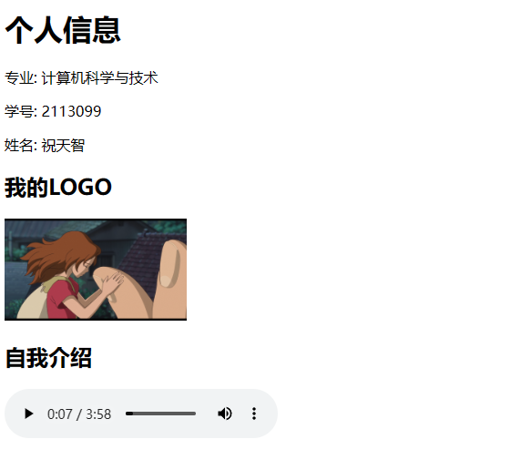

### Wireshark捕获

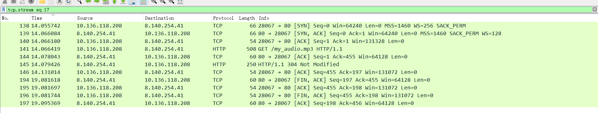

#### 三次握手

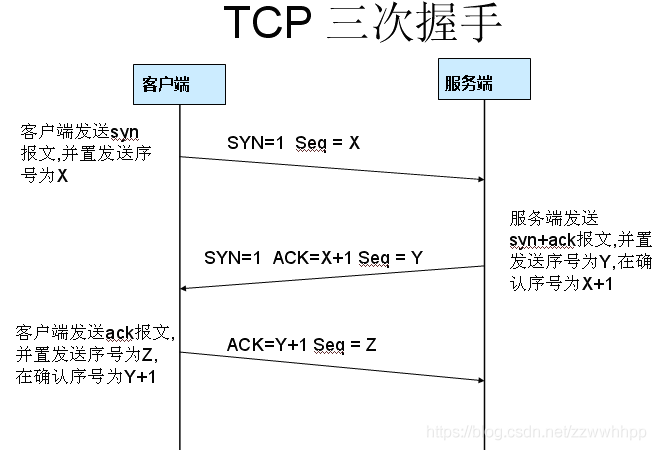

**第一次握手**：

客户端发送一个数据包请求连接，客户端设置该数据包的SYN设置为1，ACK设置为0，同时，sequence表示当前发送的随机序列号。

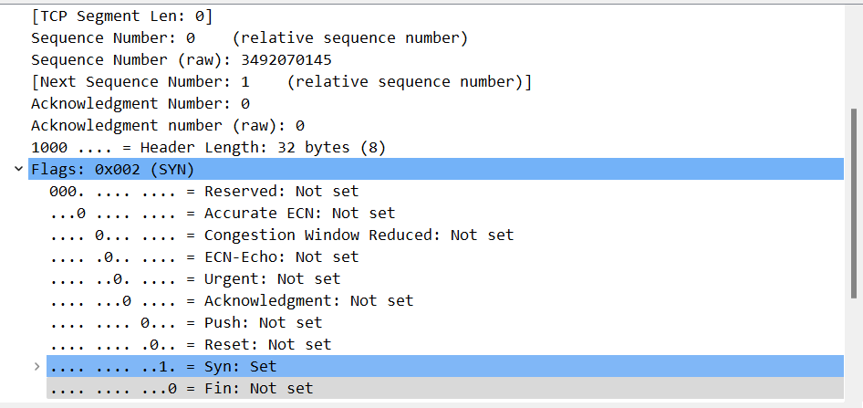

**第二次握手**：

服务器接收到请求之后并且允许连接的话，就会发送一个SYN=1，ACK=1，并且Acknowledgment等于接收到的序列号加1，sequence设置为当前发送数据包的随机序列号，并且让客户端发送一个确认数据包。

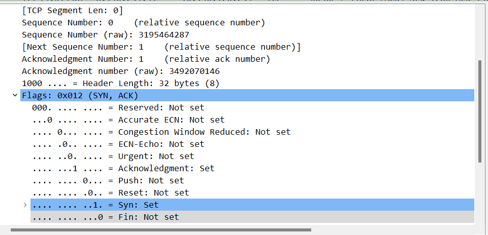

**第三次握手**：

客户端会发送一个SYN=0，ACK=1，Acknowledgment等于接收到的序列号加1的一个数据包进行连接确认，以完成连接。

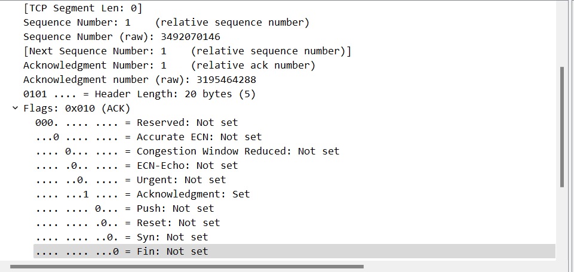

#### 四次挥手

**第一步（FIN=1，Sequence Number=x）**：

1. 主动关闭方发送一个FIN（Finish）标志位为1的TCP段，表示它已经完成数据传输，并准备关闭连接。
2. Sequence Number（序列号）字段包含主动关闭方的随机序列号（x），用于标识关闭请求。

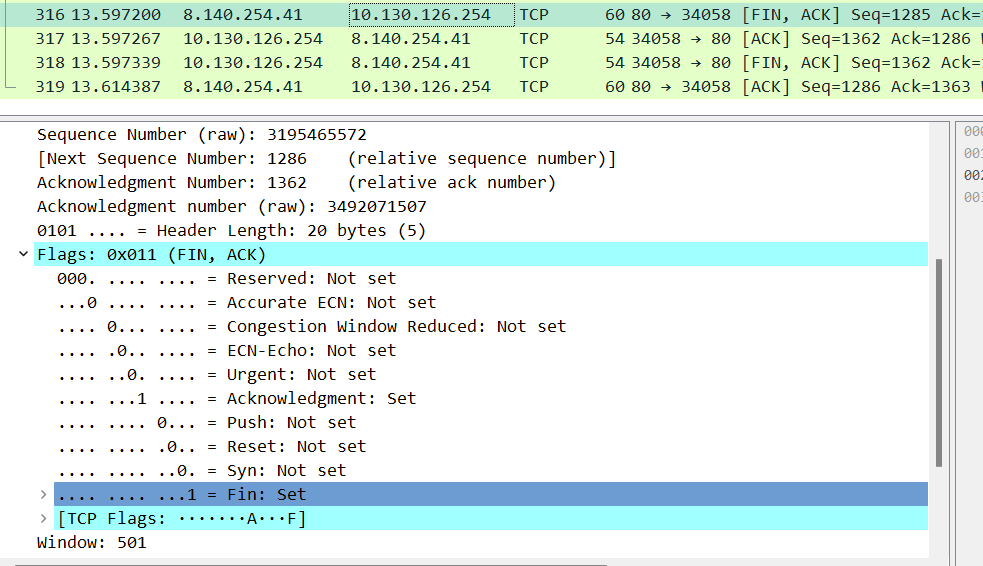

**第二步（ACK=1，Sequence Number=y，Acknowledgment Number=x+1）**：

1. 被动关闭方（Server）收到主动关闭方的FIN请求后，确认收到了该FIN请求。
2. 被动关闭方发送一个ACK（Acknowledgment）标志位为1的TCP段，表示它确认收到了主动关闭方的FIN请求。
3. 被动关闭方在Acknowledgment Number字段中确认了主动关闭方的序列号（x+1），以示知悉。

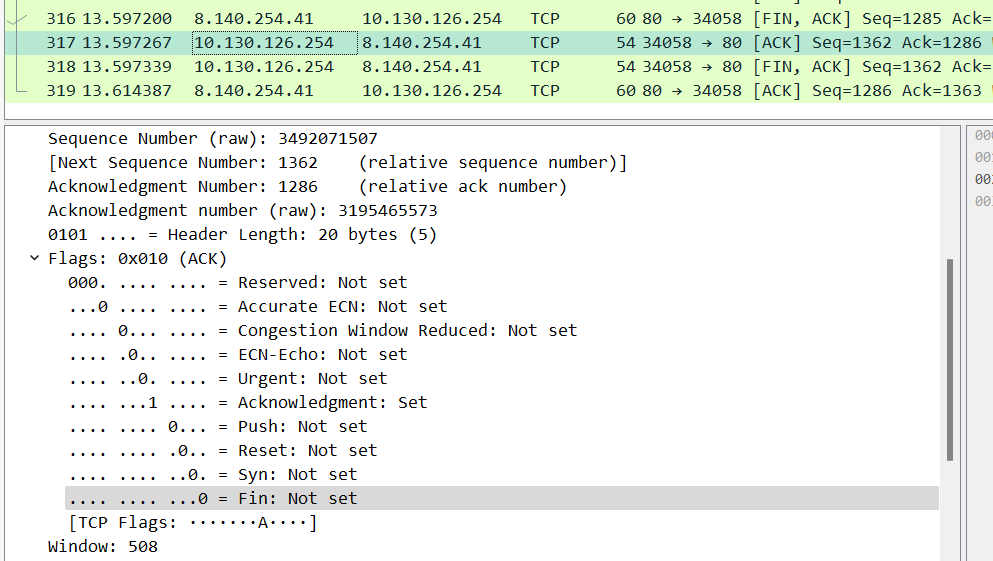

**第三步（FIN=1，Sequence Number=z，Acknowledgment Number=x+1）**：

1. 被动关闭方在确认了主动关闭方的FIN请求后，它也开始关闭自己的连接。
2. 被动关闭方发送一个FIN标志位为1的TCP段，表示它已经完成数据传输，并准备关闭自己的一部分。
3. Sequence Number字段（z）包含被动关闭方的序列号。

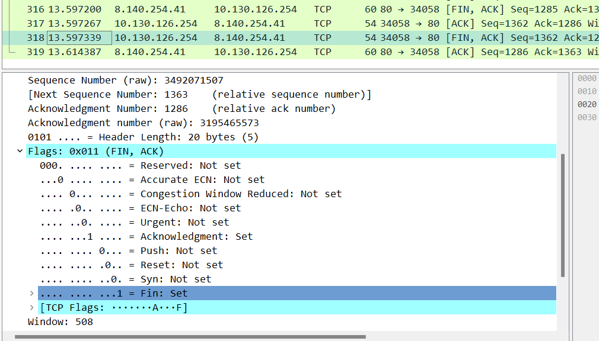

**第四步（ACK=1，Acknowledgment Number=y+1）**：

1. 主动关闭方收到被动关闭方的FIN请求后，确认收到了该FIN请求。
2. 主动关闭方发送一个ACK标志位为1的TCP段，表示它确认收到了被动关闭方的FIN请求。
3. Acknowledgment Number字段中确认了被动关闭方的序列号（y+1）。

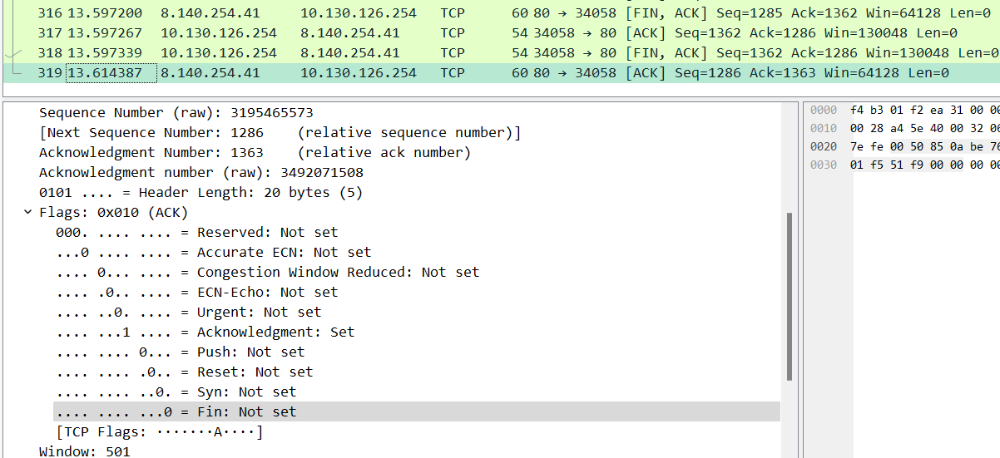

#### GET请求

**HTTP请求报文格式**

（1）请求行：由3部分组成，分别为：请求方法、URL（见备注1）以及协议版本，之间由空格分隔，请求方法包括GET、POST等。协议版本的格式为：HTTP/主版本号.次版本号，常用的有HTTP/1.0和HTTP/1.1。

（2）请求头部包含很多客户端环境以及请求正文的有用信息。请求头部由“关键字：值”对组成，每行一堆，关键字和值之间使用英文“：”分隔。

（3）空行，这一行非常重要，必不可少。表示请求头部结束，下面就是请求正文。

（4）请求正文：可选部分，比如GET请求就没有请求正文；POST比如以提交表单数据方式为请求正文。

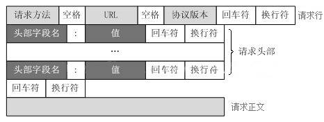

**HTTP响应报文格式**

（1）状态行由由3部分组成，分别为：协议版本，状态码，状态码描述，之间由空格分隔。状态代码为3位数字，200~299的状态码表示成功，300~399的状态码指资源重定向，400~499的状态码指客户端请求出错，500~599的状态码指服务端出错（HTTP/1.1向协议中引入了信息性状态码，范围为100~199）。

（2）响应头部与请求头部类似，也包含了很多有用的信息。

（3）空行，这一行非常重要，必不可少。表示响应头部结束

（4）响应正文，服务器返回的文档，最常见的为HTML网页。

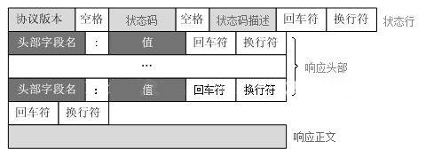


HTTP协议是基于TCP协议，默认是80端口。

**get请求**：

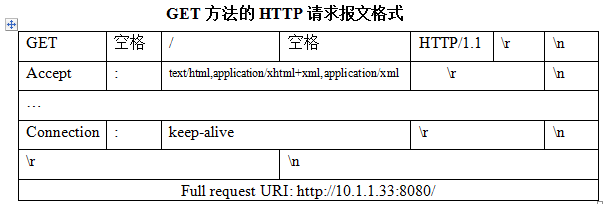

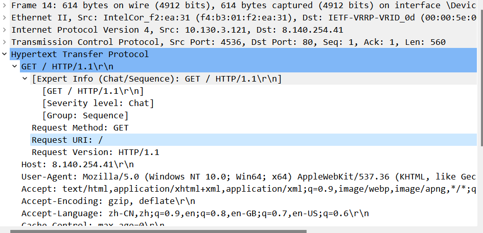

**get响应**：

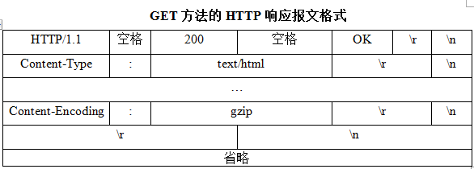

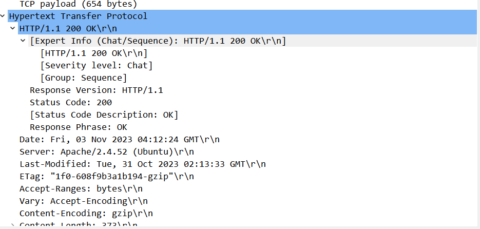

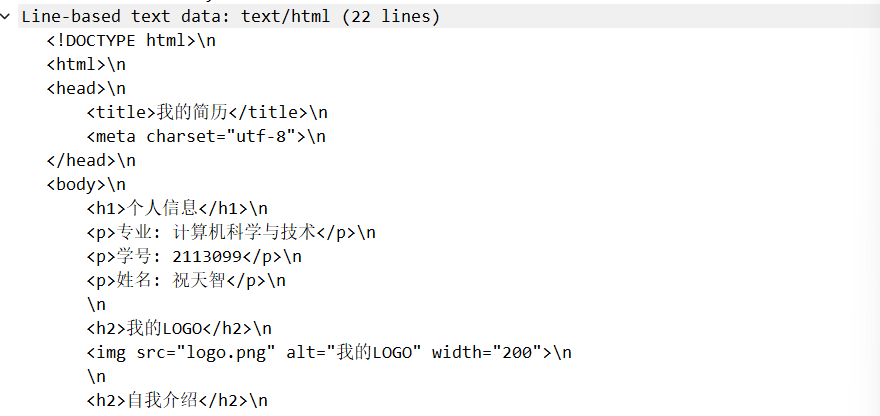

#### 数据传递

在用户请求音频的时候，服务器首先确认请求，然后发送包含音频的数据包，其中，PSH表示有 DATA数据传输。

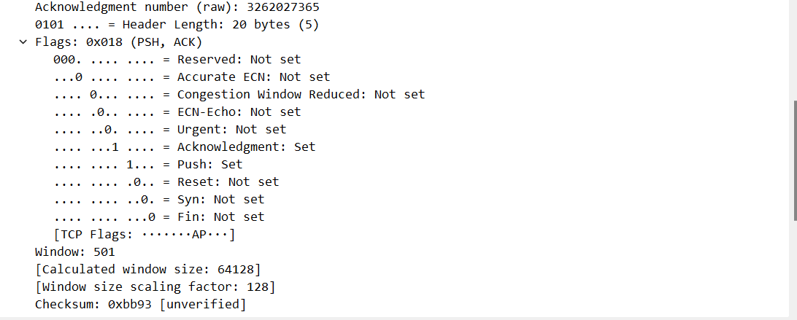

#### 保持连接

HTTP中keep-alive头部的作用是为保持TCP连接，这样可以复用TCP连接不需要为每个HTTP请求都建立一个单独的TCP连接。当服务器最后发送一个ACK包后进入TIME_WAIT状态，此状态将会持续2MSL（Maximum Segment Lifetime）。在此期间还是可以接受客户端的数据的。

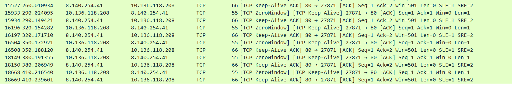

**为什么主动发起断开连接的一方在发送最后一个ACK包后需要进入TIME_WAIT状态2MSL？**

1）我们先假设发送完最后一个ACK包后直接断开的话，如果由于某种原因对端没有收到的话，对端会再次发送一个FIN包（TCP的重传机制），由于此时另一端已经关闭了对应的socket，所以TCP协议栈会发送一个RST包。这个包表示的是一种错误。（比如，请求的TCP连接的端口没有在监听状态下），那么TCP连接就是因错误而被迫断开，所以TCP中工作没有正常完成。

2）第二个原因是让老的重复包在网络中消失，解释一下这句话的意思：如果我们的TCP断开之后，立马有一个新的TCP连接和之前的连接的IP和端口都一样的话，那么残留在网络中的包到达后会被误解为是新的。