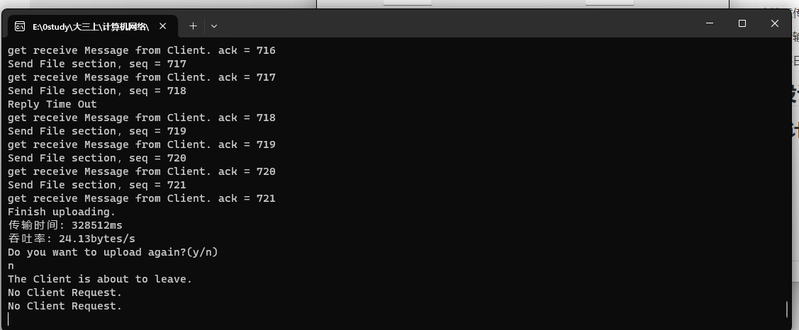

# 实验3-1：基于UDP服务设计可靠传输协议并编程实现

​	利用数据报套接字在用户空间实现面向连接的可靠数据传输，功能包括：建立连接、差错检测、接收确认、超时重传等。流量控制采用停等机制，完成给定测试文件的传输。

## **实验要求：**

1. 数据报套接字：UDP 
2. 建立连接：实现类似 TCP 的握手、挥手功能 
3. 差错检测：计算校验和 
4. 确认重传：rdt2.0 、rdt2.1 、rdt2.2 、rdt3.0 等，亦可自行设计协议 
5. 单向传输：发送端、接收端 
6. 有必要日志输出

## 程序设计

### 协议设计

```
struct Packet
{
	unsigned char flg;// 连接建立、断开标识，表示数据包类型
	int seq;// 序列号
	int ack;// 确认号
	unsigned short len;// 数据部分长度
	unsigned short checksum;// 校验和
	char data[DATASIZE];// 数据长度
}
```

​	因为要实现单向传输，服务器在发送数据后要接收客户端的返回信息，因此设定了序列号 seq 和确认 号 ack。此外，用 flg 变量来标识当前数据报所携带的信息类型，便于双方进行对应的处理。数据报类 型主要分为以下几种：

```
enum ConnectionState {// 枚举，数据包类型
	ConnectRequest, ServerPrepared, ClientPrepared, LeaveRequest, AcceptLeave = 10
};
enum MessageType {
	SendHeader = 4, Message = 5, SendTail = 6, replyMessage = 7, replyHeader = 8
};
```

### 建立连接

​	本实验实现的建立连接过程需要三次握手： 

1. 第一次握手：客户端向服务器发送请求 
2. 第二次握手：服务器向客户端发送应答信息，表示已准备连接 
3. 第三次握手：客户端向服务端发送信息，表示客户端已准备链接

​	同时实现建立连接过程中的超时重传。

```
// 服务器握手建立连接
bool shakeHands() {
    Packet* packet = new Packet();// 创建数据报准备接收请求
    int state = -1;// 初始状态为等待客户端请求状态
    while (true) {// 持续监听等待客户端请求
        recvSize = recvfrom(sockServer, (char*)packet, BUFFER, 0, ((SOCKADDR*)&addrClient), &length);
        if (recvSize > 0) {
            if (packet->flg == ConnectRequest) {
                state = ConnectRequest;// 如果收到请求，开始握手
                clock_t start = clock();
                clock_t end = clock();
                while (true) {
                    switch (state) {
                    case ConnectRequest: {// 收到客户端请求后，发送服务器已准备数据报
                        cout << "Get Connection Request...PleaseWait" << endl;
                        Packet* serverPacket = new Packet(ServerPrepared);
                        sendto(sockServer, (char*)serverPacket, BUFFER, 0, (SOCKADDR*)&addrClient, sizeof(SOCKADDR));
                        cout << "send successfully" << endl;
                        state = ServerPrepared;
                        start = clock();
                        break;
                    }
                    case ServerPrepared: {// 服务器已准备，持续监听客户端已准备的信息，收到后返回，成功握手建连接
                        recvSize = recvfrom(sockServer, (char*)packet, BUFFER, 0, ((SOCKADDR*)&addrClient), &length);
                        if (recvSize > 0 && packet->flg == ClientPrepared) {
                            cout << "Client Connected Successfully." << endl;
                            Sleep(3000);
                            return true;
                        }
                        else {
                            end = clock();
                            if (double(end - start) / CLOCKS_PER_SEC > 1) {
                                cout << "Reply Time Out" << endl;
                                Packet* serverPacket = new Packet(ServerPrepared);
                                sendto(sockServer, (char*)serverPacket, BUFFER, 0, (SOCKADDR*)&addrClient, sizeof(SOCKADDR));
                                start = clock();
                            }
                        }
                    }
                    }
                }
            }
        }
        else {//每2s检查一次是否有客户端请求
            cout << "No Client Request." << endl;
            Sleep(500);
            continue;
        }
    }
    return false;
}
```

```
// 客户端握手建立连接
bool shakeHands() {
    // 创建并发送一个连接请求的数据报
    Packet* packet = new Packet(ConnectRequest);
    sendto(socketClient, (char*)packet, BUFFER, 0, (SOCKADDR*)&addrServer, sizeof(SOCKADDR));
    // 发送成功的提示信息
    cout << "Send Request Successfully!" << endl;
    cout << "Wait for Server..." << endl;
    int state = ConnectRequest;// 记录当前的客户端状态为连接请求状态
    bool serverflg = 0;// 服务器是否已准备的标识
    clock_t start = clock();
    clock_t end = clock();
    // 持续监听服务器信息并与之进行握手
    while (true) {
        switch (state) {// 根据当前状态进行对应操作
        case ConnectRequest: {// 连接请求状态:此时客户端持续监听服务器发来的SeverPrepared消息。
            int recvSize = recvfrom(socketClient, (char*)packet, sizeof(*packet), 0, (SOCKADDR*)&addrServer,
                &length);
            if (recvSize > 0 && packet->flg == ServerPrepared) {// 如果是服务器已准备的信息类型
                state = ServerPrepared;// 将状态置为服务器已准备
                start = clock();
            }
            else {
                Sleep(200);
                end = clock();
                //                    cout<<double(end-start)/CLOCKS_PER_SEC<<endl;
                if (double(end - start) / CLOCKS_PER_SEC > 2) {
                    cout << "Reply Time Out" << endl;
                    sendto(socketClient, (char*)packet, BUFFER, 0, (SOCKADDR*)&addrServer, sizeof(SOCKADDR));
                    start = clock();
                }
            }
            break;
        }
        case ServerPrepared: {// 服务器已准备状态：向服务器发送客户端已准备的数据报，并成功返回，表示握手成功
            Packet* clientPreparedPacket = new Packet(ClientPrepared);
            if (!serverflg) {// 输出提示信息
                serverflg = true;
                cout << "Server has Prepared." << endl;
            }
            sendto(socketClient, (char*)clientPreparedPacket, BUFFER, 0, (SOCKADDR*)&addrServer, sizeof(SOCKADDR));
            start = clock();
            while (true) {
                int recvSize = recvfrom(socketClient, (char*)packet, sizeof(*packet), 0, (SOCKADDR*)&addrServer,
                    &length);
                if (recvSize > 0 && packet->flg == ServerPrepared) {// 如果是服务器已准备的信息类型
                    cout << "Third Shake Lost... resending..." << endl;
                    sendto(socketClient, (char*)clientPreparedPacket, BUFFER, 0, (SOCKADDR*)&addrServer,
                        sizeof(SOCKADDR));
                    start = clock();
                }
                else {
                    Sleep(200);
                    end = clock();
                    if (double(end - start) / CLOCKS_PER_SEC > 2) {
                        cout << "Shake Hands successfully" << endl;
                        return true;
                    }
                }
            }
        }
        }
    }
}
```

​	三次握手后，客户端与服务器正式建立连接。

### 差错检验

​	差错检测采用了传统 UDP 的校验和检测方法。通过在发送端将数据报包装好并计算校验和，同 时在接收端接收到数据报后重新计算校验和并比对，进而判断出数据包发送是否正确。

### 文件发送协议设计

​	文件发送的协议如下： 

1. 服务端先行发送文件头，告知所要发送的文件名和文件路径 
2. 客户端收到后发送成功接收文件头的应答数据报，并指定下载路径 
3. 服务端根据文件大小进行分块，依次发送。客户端依次应答。 
4. 服务端在发送最后一个分块时，将信息类型设置为文件尾部 (SendTail)，告知客户端当前为最后 一个分区。

### 确认重传机制

​	客户端和服务端是通过维护 seq 和 ack 来确认接收到的数据报是否是我们所需要的数据报的。在服务端维护 nowSeq 变量来得知即将发送的数据报序列号应为多少，同时维护 nowAck 变量来得知下一次接收到的客户端的应答确认号应为多少。同样地，客户端维护 expectSeq 变量来表示期望接受的 数据报序列号为多少。通过上述信息我们可以知道，我们的协议在维护这几件事： 

​	情况一：服务端维护客户端应答消息，如果客户端发送的 Ack 应答与 nowAck 不相等，说明客户端并没有接收到对应序列号的数据报，需要重传； 

​	情况二：客户端维护服务端数据序列号，如果服务端发送的 Seq 序列号与 expectSeq 不相同，说明客户端发送的 Ack 应答可能没有成功发送到服务端，导致服务端“误以为”客户端没有成功接收， 此时要补发 Ack 应答。

### 超时重传机制

​	服务端每次发送数据报后都会等待一定的时间接收应答数据报，如果超过这个使时间，服务端会认为应答超时，将会重传当前数据报。这个等待时间为 2s。在建立连接和发送数据的过程中实现超时重传机制。

### 停等机制

​	在没有成功收到应答之前，服务端是永远不会发送下一个数 据报的，会持续不断的重传数据报并监听应答。直到我们收到了正确的 Ack 应答。

### 断开连接过程

​	因为本次实验中只有一端发送，所以断开连接的协议采用两次挥手。当服务端传输完毕后，客户端可以请求断开连接，服务器收到断开连接请求后，向客户端发送同意断开连接数据报后，二者断开连接。此后服务器继续监听客户端，等待客户端的连接请求。

### 结果展示

首先是建立连接，服务器绑定127.0.0.1:12345，客户端绑定127.0.0.1:1234，路由器绑定127.0.0.1:6666。


设置传输文件地址和文件存储地址


触发丢包，超时重传。


传输完毕，输出传输时间和吞吐率


退出，两次挥手断开连接

